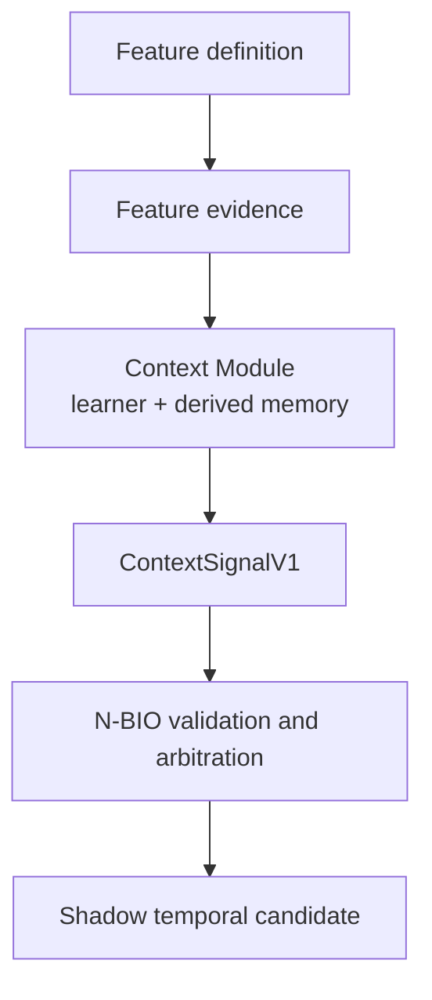

# N-BIO Context Modules

A Context Module learns from one kind of structured context. It owns its derived learning state and returns candidate `ContextSignalV1` values to N-BIO. It cannot change N-BIO Core, workout prescriptions, or raw evidence directly.

[Build your first module](./QUICKSTART.md) · [Authoring guide](./AUTHORING.md) · [SPI reference](./REFERENCE.md) · [Troubleshooting](./TROUBLESHOOTING.md)

## Why modules exist

Different context features need different rules. An illness-like event may persist across sessions. A session constraint may only change how noisy one observation is. N-BIO therefore gives each module its own learner and memory while keeping one controlled signal boundary into Core.

Adding a module does not require a feature-specific branch in the temporal model or arbitrator.

## What a module can do

A module can:

- read its declared feature evidence;
- read time, scope, and other data covered by an allowed capability;
- update its own derived state;
- return zero or more candidate `ContextSignalV1` values;
- keep row, session, and episode support separate;
- fail without stopping unrelated modules or the context-free baseline.

A module cannot:

- query DAOs or use arbitrary database access through this SPI;
- read raw notes, Health data, or unrestricted workout history;
- mutate canonical evidence or N-BIO Core state;
- change loads, reps, set counts, exercise selection, or programme behaviour;
- download or load executable plug-ins at runtime.

The host gives a module only the read capabilities in its descriptor. A declared capability can still return no value when the data is unavailable.

## What is implemented now

The build contains two production modules:

| Module | Learner | Candidate output |
|---|---|---|
| `context.illness.episode.v1` | Episode persistence and association | `SYSTEMIC_TRANSIENT_STATE` |
| `context.time_pressure.observation_variance.v1` | Present-versus-known-false variance comparison | `OBSERVATION_VARIANCE` |

Both passed structural and synthetic validation. At N-BIO-7E closure, installed history contained no eligible context tags, so neither module had real-history support. PD-003 remains open and all outputs remain SHADOW candidates.

`LOCAL_TRANSIENT_STATE` is different: the protocol can carry, validate, and arbitrate it, but the current temporal model has no evolving local state that consumes it. See the [target matrix](./REFERENCE.md#signal-targets).

## Choose a path

- **First module:** follow the [quickstart](./QUICKSTART.md). It uses a compile-tested synthetic fixture and the real SPI.
- **Implement a real module:** use the [authoring guide](./AUTHORING.md).
- **Understand the design:** read [concepts and boundaries](./CONCEPTS.md).
- **Look up a field or capability:** use the [SPI reference](./REFERENCE.md).
- **Change stored state or versions:** use [versioning and replay](./VERSIONING_AND_REPLAY.md).
- **Study real learners:** read the [production module examples](./EXAMPLES.md).
- **Fix a problem:** start with [troubleshooting](./TROUBLESHOOTING.md).

## Find an exact answer

| Question | Go to |
|---|---|
| What fields can `ContextSignalV1` contain? | [Signal reference](./REFERENCE.md#contextsignalv1) |
| Why was my signal rejected? | [Rejected-signal troubleshooting](./TROUBLESHOOTING.md#my-signal-was-rejected) |
| How does a module remember data across sessions? | [State and codec workflow](./AUTHORING.md#3-create-module-owned-state-and-a-codec) |
| Can my module read SessionDose? | [Read capabilities](./REFERENCE.md#read-view-and-capabilities) |
| What do I change when stored state changes? | [Versioning workflow](./VERSIONING_AND_REPLAY.md#change-a-stored-state-format) |

## Source and authority

The author-facing SPI is currently **EXPERIMENTAL**. That label describes compatibility, not scientific support. The module architecture is structurally validated, while personal effect calibration remains pending under PD-003.

PD-001, PD-002, and PD-003 all remain open. They cover upstream capability calibration, SessionDose calibration, and 7E temporal/context calibration respectively. Structural closure did not convert any of them into product authority.

Current source is the final API authority. The [7E state/context contract](../NBIO_7E_STATE_CONTEXT_CONTRACT.md) and [physical closure record](../NBIO_7E_STATE_CONTEXT_PHYSICAL_CLOSURE_2026-09-04.md) explain the accepted scientific and product boundaries. The [rough extension journal](../NBIO_7E_CONTEXT_EXTENSION_JOURNAL.md) is historical design evidence, not the author guide.
